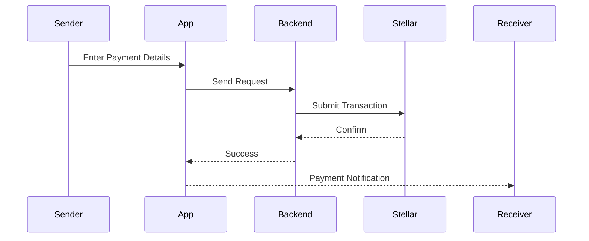

# Remit-Frontend
# 🚀 SwiftRemit  
### Instant Cross-Border Payments for Africa (Powered by Stellar)

---

## 📌 Overview
SwiftRemit is a blockchain-powered cross-border payment platform designed to eliminate the high cost and delays associated with international money transfers in Africa.

Built on the Stellar network, SwiftRemit enables near-instant, low-cost payments using stablecoins like USDC.

---


## 🖼️ UI Preview


## 🌍 Problem Statement
Cross-border payments in Africa face major challenges:

- High transaction fees (5–10%)
- Slow settlement times (2–5 days)
- Limited access to global payment systems
- Currency conversion inefficiencies

These issues negatively impact freelancers, SMEs, and families relying on remittances.

---

## 💡 Solution
SwiftRemit provides:

- ⚡ Instant payments (3–5 seconds)
- 💸 Near-zero transaction fees
- 🌐 Stablecoin (USDC) transactions
- 🔄 Seamless fiat conversion (future integration)

---

## ✨ Core Features

- Stellar Wallet Integration (Freighter, etc.)
- Fast & Secure Payments
- Transaction History Dashboard
- Real-time Payment Notifications
- Scalable API Architecture

---

## 🏗️ System Architecture
flowchart LR
    A[User] --> B[Frontend (React)]
    B --> C[Backend API (Node.js)]
    C --> D[Stellar SDK]
    D --> E[Stellar Network]
    E --> F[Recipient Wallet]
    C --> G[(Database)]
```

---

## 🔄 Payment Flow



---

## 🧠 Tech Stack

### Frontend
- React
- TypeScript
- Tailwind CSS

### Backend
- Node.js
- Express.js

### Blockchain
- Stellar SDK
- Stellar Testnet (MVP)

---

## ⚙️ How It Works

1. User connects wallet  
2. Inputs recipient address  
3. Enters amount  
4. Transaction sent via Stellar  
5. Payment confirmed within seconds  

---

## 📊 Impact

SwiftRemit will:

- Reduce remittance costs across Africa  
- Enable instant global payments  
- Improve financial inclusion  
- Empower freelancers & SMEs  

---

## 🧪 Current Progress

- ✅ Architecture Designed  
- ✅ UI Development Started  
- 🔄 Stellar Integration in Progress  
- 🔄 MVP Testing on Testnet  

---

## 🛣️ Roadmap

- [ ] MVP Release  
- [ ] Mainnet Launch  
- [ ] Mobile App  
- [ ] Fiat On/Off Ramp  
- [ ] Escrow System  

---

## 🔐 Security

- Wallet-based authentication  
- API security & rate limiting  
- Secure transaction validation  

---

## 📎 Getting Started

```bash
git clone https://github.com/your-username/swiftremit
cd swiftremit
npm install
npm run dev
```

---

## 🤝 Contribution

We welcome contributors in:
- Blockchain Development  
- Fintech Solutions  
- Frontend Engineering  

---

## 📢 Vision

To power a financially inclusive Africa where anyone can send and receive money globally without barriers.

---

## 🏁 Conclusion

SwiftRemit leverages Stellar’s speed and efficiency to redefine cross-border payments in Africa, making them faster, cheaper, and more accessible.
